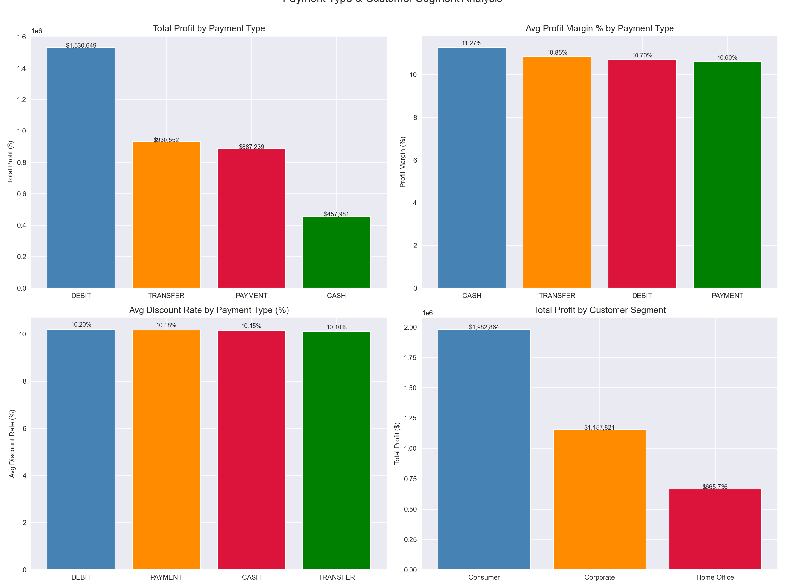
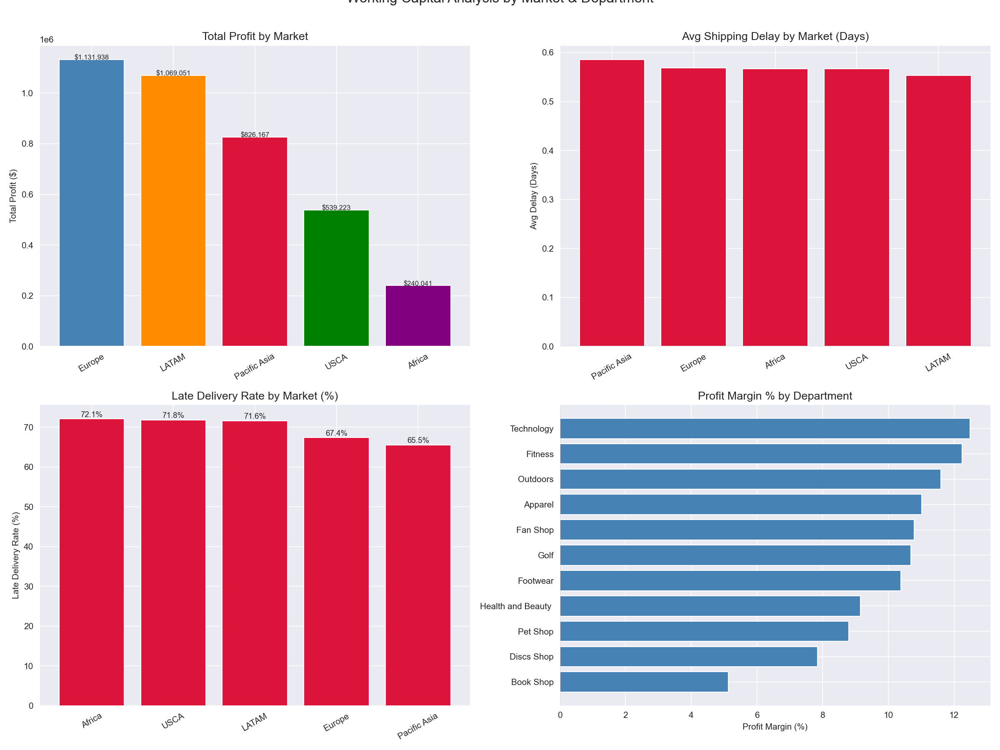
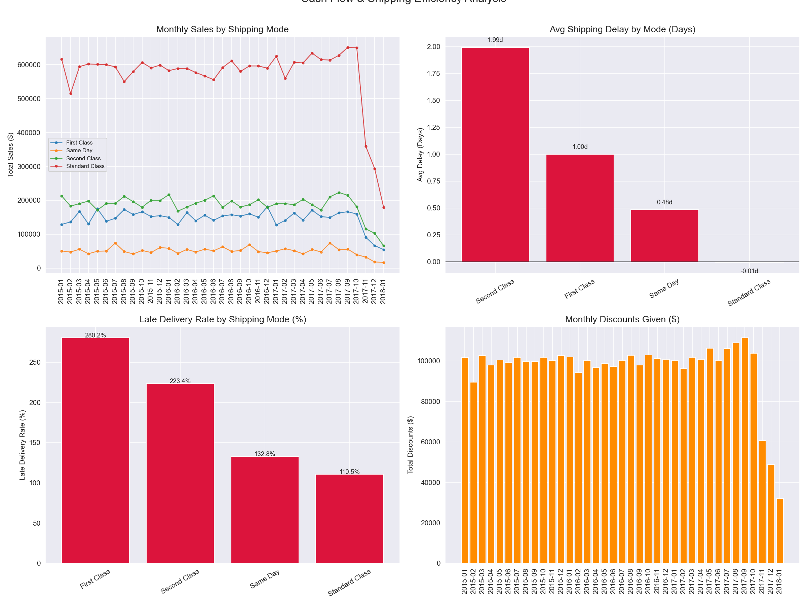
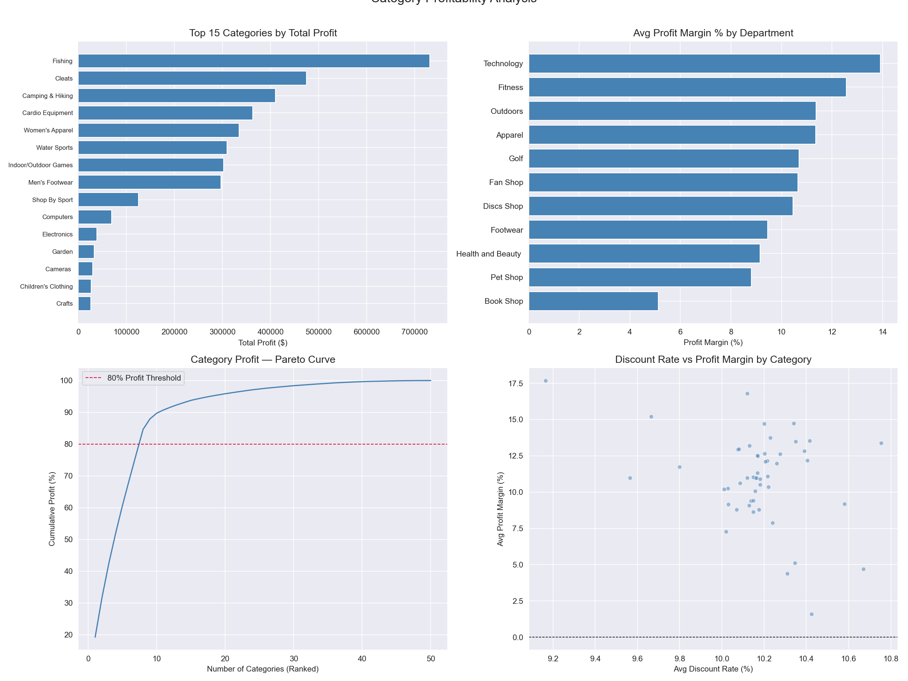
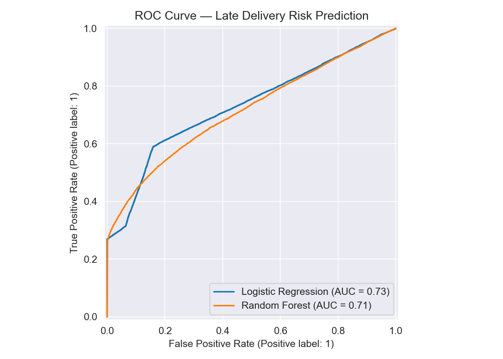
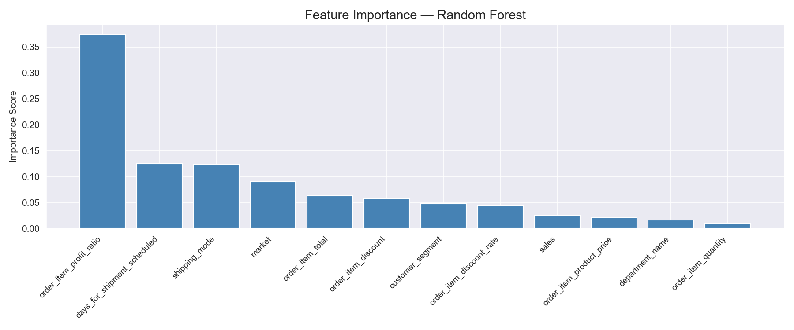
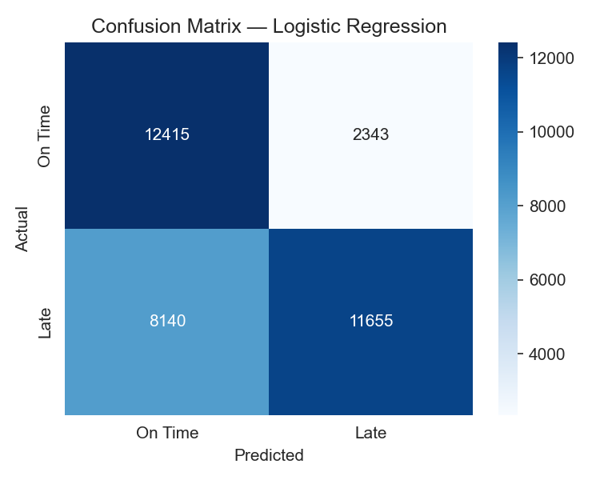
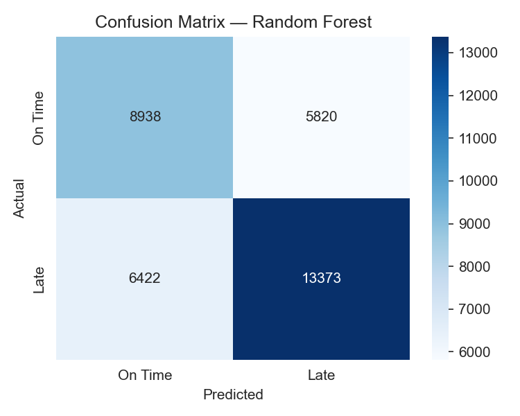

# Supply Chain Finance Analysis — Payment Terms, Working Capital & Cash Flow

A SQL and Python analysis of 172,765 supply chain orders across global markets (2015–2018), examining payment type profitability, working capital efficiency, shipping delay patterns, category-level margin analysis, and late delivery risk prediction using PostgreSQL, Python, and Scikit-learn.

---

## Problem Statement
Supply chain finance is one of the most critical functions in corporate treasury and operations management. This project analyzes a global supply chain dataset to answer:
- Which payment types and customer segments drive the most profit?
- Where are the working capital inefficiencies by market and department?
- How do shipping delays impact cash flow and profitability?
- Which product categories generate the highest profit margins?
- Can machine learning predict late delivery risk at order placement?

---

## Dataset
- **Source:** [Kaggle — DataCo Supply Chain Dataset](https://www.kaggle.com/datasets/shashwatwork/dataco-smart-supply-chain-for-big-data-analysis)
- **Size:** 172,765 orders (after removing cancelled and suspected fraud orders)
- **Period:** January 2015 – January 2018
- **Total Sales:** $35,214,429.65
- **Total Profit:** $3,806,420.63
- **Overall Late Delivery Rate:** 57.29%
- **Database:** PostgreSQL (local)

---

## Tools & Libraries
- PostgreSQL, pgAdmin
- Python 3.x
- Pandas, NumPy
- Matplotlib, Seaborn
- Scikit-learn (Logistic Regression, Random Forest)
- SQLAlchemy, psycopg2

---

## Project Workflow
1. Data ingestion — loaded CSV into PostgreSQL via Python, selected and renamed relevant columns, removed cancelled and suspected fraud orders, engineered shipping delay, late delivery flag, and gross margin features
2. SQL analysis — payment type profitability, working capital by market and department, cash flow and shipping efficiency, category profitability with Pareto ranking using Window Functions
3. Python visualization — payment analysis, working capital by market, cash flow trends, category profitability, late delivery risk prediction
4. Predictive modeling — binary late delivery risk classification using Logistic Regression and Random Forest with 5-fold cross-validation

---

## SQL Techniques Demonstrated
- Common Table Expressions (CTEs)
- Window Functions (RANK, NTILE, cumulative SUM OVER, PARTITION BY for quarterly ranking)
- LAG for month-over-month sales growth
- Conditional aggregation (CASE WHEN) for late delivery counting
- NULLIF for safe division in margin calculations
- Multi-level GROUP BY across market, department, shipping mode, and category dimensions

---

## Key Findings
- **57.29% overall late delivery rate** across 172,765 orders — a systemic supply chain failure operating at less than half the 95%+ benchmark of world-class supply chains, affecting every market uniformly
- **Every market exceeds 65% late delivery rate** — Africa (72.09%), USCA (71.83%), LATAM (71.61%), Europe (67.39%), Pacific Asia (65.52%) — ruling out regional logistics as the cause and pointing to systemic order planning or supplier failures
- **First Class shipping underperforms Standard Class on delivery reliability** — the premium mode shows higher late delivery concentration than the standard mode, the opposite of customer expectations and service level agreements
- **Fishing ($731,576.18) leads all categories in profit**, followed by Cleats ($474,629.51) and Camping & Hiking ($409,895.62) — top 5 categories all maintain 10.37–11.02% margins confirming consistent pricing discipline
- **Computers show the highest profit margin (11.98%)** despite ranking 10th in total profit — a high-efficiency small category warranting expanded inventory investment
- **Cash payments achieve the highest profit margin (11.27%)** vs digital Payment (10.60%) — reflecting payment processing fee differences and the working capital advantage of immediate cash settlement
- **Logistic Regression outperformed Random Forest** on ROC-AUC (0.73 vs 0.71) with higher late delivery precision (0.83) — 83% of flagged orders are genuinely late, making it highly actionable for logistics intervention teams
- **order_item_profit_ratio dominates feature importance (0.3745)** — a counterintuitive finding suggesting it acts as a proxy for product category or supplier tier rather than directly causing delivery delays

---

## Visualizations

### Payment Type Analysis

### Working Capital by Market & Department

### Cash Flow & Shipping Efficiency

### Category Profitability

### ROC Curve Comparison

### Feature Importance

### Confusion Matrices

---

## SQL Query Files
All queries are saved in the `sql/` folder:
- `01_create_table.sql` — schema creation
- `02_payment_analysis.sql` — payment type profitability by customer segment
- `03_working_capital.sql` — working capital metrics by market and department with quarterly profit ranking
- `04_cash_flow_analysis.sql` — monthly cash flow by shipping mode with LAG-based MoM growth and discount tracking
- `05_window_functions.sql` — category profitability ranking with RANK, NTILE, cumulative profit Pareto curve

---

## Limitations & Next Steps
- Revenue and profit metrics exclude cost of goods sold and logistics costs — true net margin cannot be calculated
- Late delivery risk is a binary dataset flag — not independently verified against carrier records
- order_item_profit_ratio as top predictive feature is counterintuitive — likely a proxy for product category or supplier tier
- Dataset covers 2015–2018 — supply chain dynamics have changed significantly post-COVID
- Future work: supplier-level root cause analysis, real-time late delivery alert system, DSO and inventory turnover metrics, Power BI supply chain KPI dashboard

---

## How to Run This Project
1. Clone the repository
2. Install PostgreSQL and pgAdmin from [postgresql.org](https://postgresql.org)
3. Create a database called `supply_chain` in pgAdmin
4. Download `DataCoSupplyChainDataset.csv` from [Kaggle](https://www.kaggle.com/datasets/shashwatwork/dataco-smart-supply-chain-for-big-data-analysis) and place it in the project root folder
5. Install Python dependencies: `pip install pandas numpy matplotlib seaborn scikit-learn sqlalchemy psycopg2-binary`
6. Open `supply_chain_analysis.ipynb` in Jupyter or VS Code
7. Update the database connection string with your PostgreSQL password
8. Run all cells — data loads automatically into PostgreSQL and all analysis runs end to end

---

## Repository Structure

---

## Author
**Mihrimah Qozat**
[LinkedIn](https://linkedin.com/in/mihrimah-qozat) |
[GitHub](https://github.com/mihrimahqozat)
